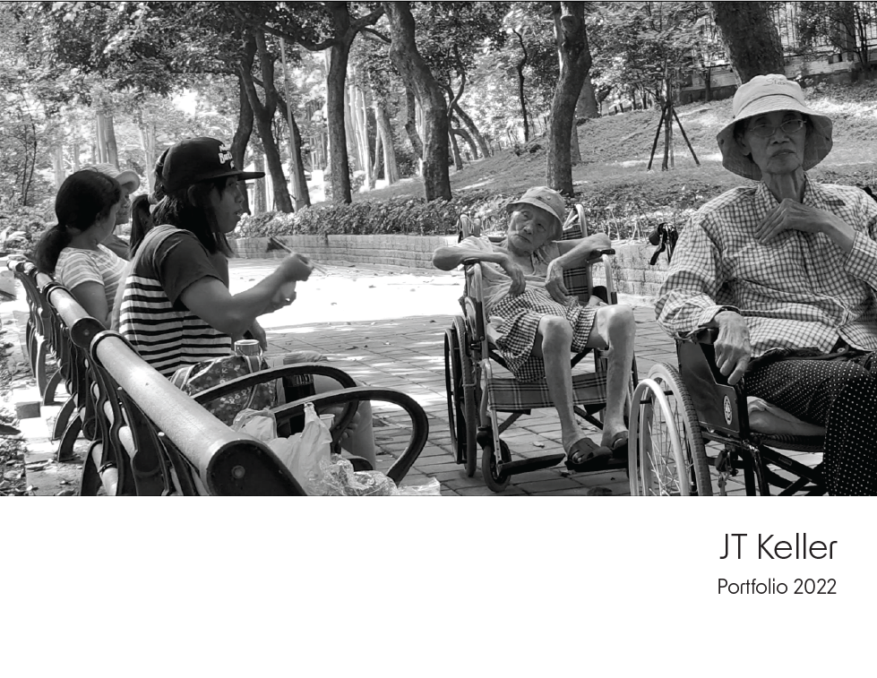

```{r setup, include=FALSE}
knitr::opts_chunk$set(echo = TRUE)
```

## Please click title page below for link to portfolio of work


[](https://jtkeller29.github.io/visual_portfolio//fullsize/Keller_portfolio_april2022.pdf)

